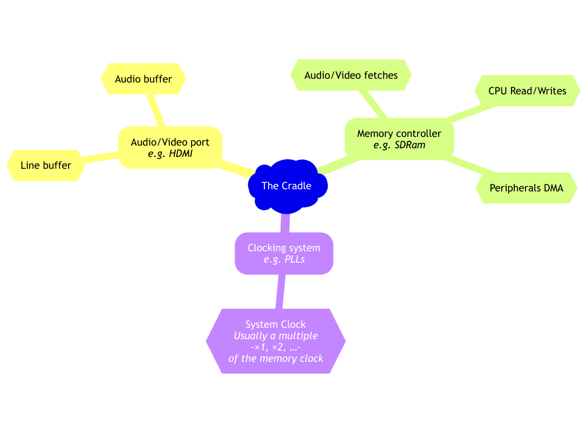

# The Cradle for MuseLab's Colorlight i9 by Sporniket

> [WARNING] Please read carefully this note before using this project. It contains important facts.

Content

1. What is **The Cradle for MuseLab's Colorlight i9 by Sporniket**, and when to use it ?
2. What should you know before using **The Cradle for MuseLab's Colorlight i9 by Sporniket** ?
3. How to use **The Cradle for MuseLab's Colorlight i9 by Sporniket** ?
4. Known issues
5. Miscellanous

## 1. What is **The Cradle for MuseLab's Colorlight i9 by Sporniket**, and when to use it ?

* The [Colorlight i9 by Muse Lab](https://fr.aliexpress.com/item/1005003832457085.html) is an FPGA based board, powered by a [Lattice ECP5](https://www.latticesemi.com/Products/FPGAandCPLD/ECP5) FPGA.
* [Amaranth HDL, previously nMigen](https://github.com/amaranth-lang/amaranth) is a python library to generate an abstract syntax tree of an hardware design, in order to configure a supported FPGA .

**The Cradle for MuseLab's Colorlight i9 by Sporniket** aims to be a Resource abstraction layer for FPGA projects, by providing an access to the commodities of the board (HDMI output, EPROM, RAM,...). 



Then a guest project can glue those commodities with an actual design, like e.g. interfacing a vintage CPU and emulate the behavior of a vintage computer.

### What's new in v0.1.0

* First release : the onboard led blinks every second, and when branched to an HDMI screen, a solid-colored screen blinks between a blue-ish and a yellow-ish color.


### Licence
 **The Cradle for MuseLab's Colorlight i9 by Sporniket** is free software: you can redistribute it and/or modify it under the terms of the
 GNU Lesser General Public License as published by the Free Software Foundation, either version 3 of the License, or (at your
 option) any later version.

 **The Cradle for MuseLab's Colorlight i9 by Sporniket** is distributed in the hope that it will be useful, but WITHOUT ANY WARRANTY; without
 even the implied warranty of MERCHANTABILITY or FITNESS FOR A PARTICULAR PURPOSE. See the GNU Lesser General Public License for
 more details.

 You should have received a copy of the GNU Lesser General Public License along with **The Cradle for MuseLab's Colorlight i9 by Sporniket**.
 If not, see http://www.gnu.org/licenses/ .


## 2. What should you know before using **The Cradle for MuseLab's Colorlight i9 by Sporniket** ?

**The Cradle for MuseLab's Colorlight i9 by Sporniket** requires a set of tools to build and deploy to an actual Colorlight i9 board :

* To build the bitstream : **Python 3.10 or later up to 3.12, pip and pdm** ; then all the dependencies required to generate the bitstream are pulled by pdm ; the most essential with regard to designing hardware logic and building the bitstream for the ECP5 FPGA :
  * [amaranth](https://github.com/amaranth-lang/amaranth).
  * [amaranth-boards](https://github.com/amaranth-lang/amaranth-boards).
  * [amaranth-stuff](https://github.com/sporniket/amaranth-stuff), notably contains the TMDS encoder.
  * Some tools from the [Unofficial WebAssembly-based packages for Yosys, nextpnr, and more](http://yowasp.org/) : yowasp-yosys and yowasp-nextpnr-ecp5

* to upload the bitstream, you will need a tool to perform this task (like [openFPGALoader](https://github.com/trabucayre/openFPGALoader) or [ecpdap](https://github.com/adamgreig/ecpdap)). This project provides a pdm script to use [openFPGALoader](https://github.com/trabucayre/openFPGALoader).

> Do not use **The Cradle for MuseLab's Colorlight i9 by Sporniket** if this project is not suitable for your project

## 3. How to use **The Cradle for MuseLab's Colorlight i9 by Sporniket** ?

### From source

> To build the bitstream only.

```
git clone https://github.com/sporniket/the-cradle-colorlight-i9-ecp5-amaranth-hdl.git
cd the-cradle-colorlight-i9-ecp5-amaranth-hdl
python3 -m pdm sync
python3 -m pdm run make_bitstream
```

Then upload the bitstream file `build/top.bit` into the ECP5 with your favorite tool. 

> If you have installed _openFPGALoader_, and with the Colorlight board plugged in : 

```
python3 -m pdm run make_and_deploy
```

## 4. Known issues
See the [project issues](https://github.com/sporniket/the-cradle-colorlight-i9-ecp5-amaranth-hdl/issues) page.

## 5. Miscellanous

### Report issues
Use the [project issues](https://github.com/sporniket/the-cradle-colorlight-i9-ecp5-amaranth-hdl/issues) page.

