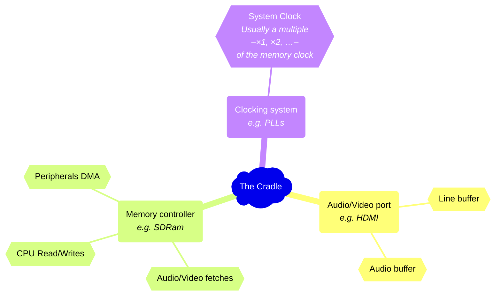

```mermaid
mindmap
root)The Cradle(
    avi(Audio/Video port 
    *e.g. HDMI*)
        {{Line buffer}}
        {{Audio buffer}}
    mem(Memory controller 
    *e.g. SDRam*)
        {{Audio/Video fetches}}
        {{CPU Read/Writes}}
        {{Peripherals DMA}}
    clk(Clocking system
    *e.g. PLLs*)
        {{System Clock
        *Usually a multiple 
        –×1, ×2, …– 
        of the memory clock*}}
```
